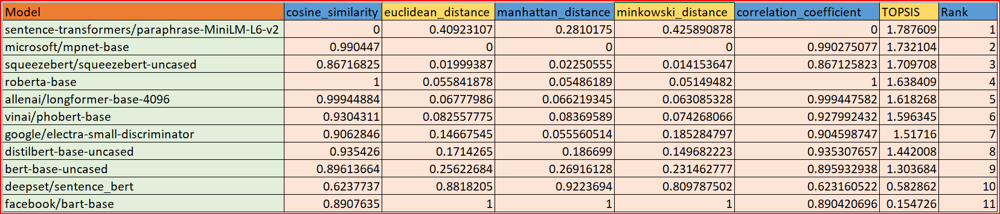

# Livanshi_102217138
# TOPSIS Analysis for Text-Sentence Similarity

## Step 1: Choose 10 pre-trained models from Hugging Face

- "facebook/bart-base"
- "allenai/longformer-base-4096"
- "google/electra-small-discriminator"
- "microsoft/mpnet-base"
- "squeezebert/squeezebert-uncased"
- "deepset/sentence_bert"
- "vinai/phobert-base"
- "bert-base-uncased"
- "roberta-base"
- "distilbert-base-uncased"
- "sentence-transformers/paraphrase-MiniLM-L6-v2"

## Step 2: Define parameters for text-sentence similarity

- Cosine Similarity
- Euclidean Distance
- Manhattan Distance
- Minkowski Distance
- Correlation Coefficient

## Step 3: Evaluate models and create a DataFrame

- Evaluate models and create a DataFrame with parameter values for each model.

## Step 4: Normalize the parameter values

- Normalize parameter values to a common scale.

## Step 5: Define criteria weights

- Assume equal weights for simplicity.

## Step 6: Calculate weighted normalized decision matrix

- Multiply normalized parameter values with criteria weights.

## Step 7: Calculate positive and negative ideal solutions

- Identify the maximum and minimum values for each criterion.

## Step 8: Calculate distance to positive and negative ideal solutions

- Calculate the distance of each model from positive and negative ideal solutions.

## Step 9: Calculate TOPSIS scores

- Calculate the TOPSIS scores for each model.

## Step 10: Rank models based on TOPSIS scores

- Rank models based on their TOPSIS scores in descending order.

## Step 11: Save the results to a CSV file

- Save the ranked results to a CSV file named "topsis_results.csv".
